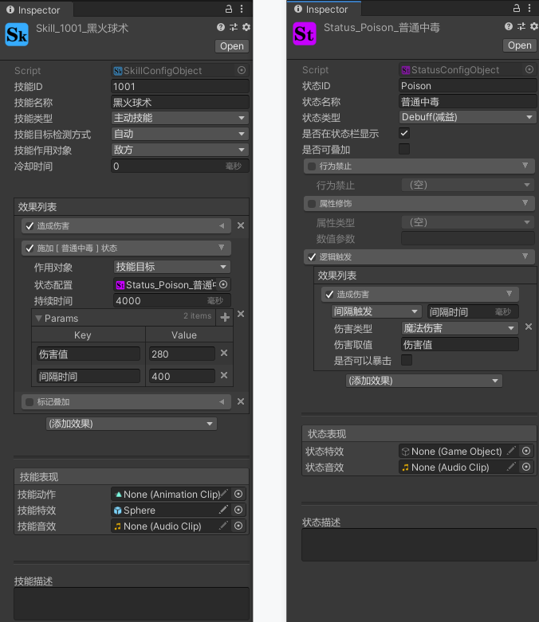
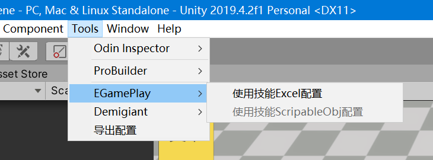
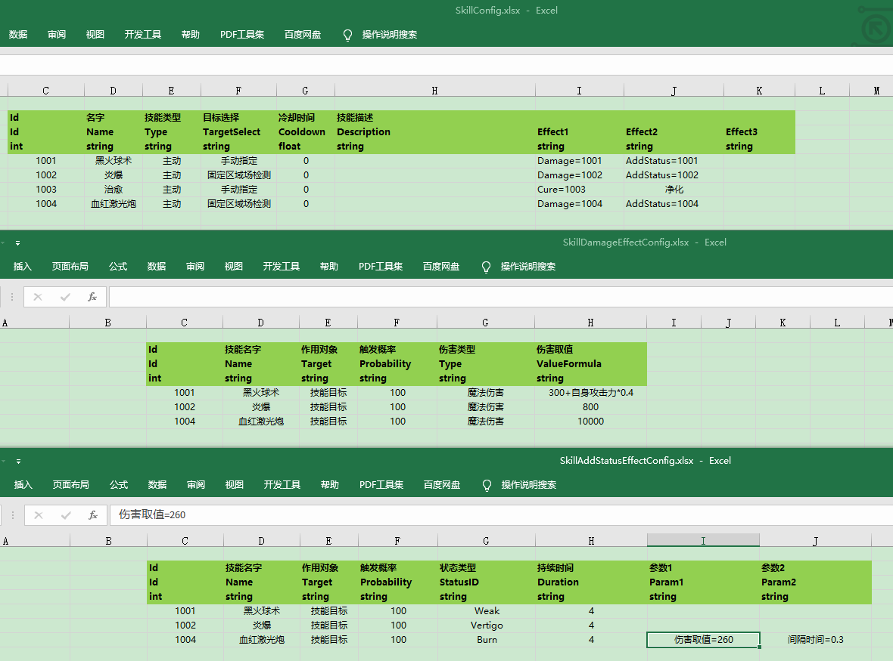

# ***EGamePlay***

---
 

---
## 知乎文章：

- [0、如何实现一个灵活、通用的战斗（技能）系统——序章](https://zhuanlan.zhihu.com/p/272216809)
- [1、如何实现一个灵活、通用的战斗（技能）系统——数值系统](https://zhuanlan.zhihu.com/p/269901872)
- [2、如何实现一个灵活、通用的战斗（技能）系统——数值系统（升级版）](https://zhuanlan.zhihu.com/p/274795206)
- [3、如何实现一个灵活、通用的战斗（技能）系统——战斗行动机制](https://zhuanlan.zhihu.com/p/272865602)
- [4、如何实现一个灵活、通用的战斗（技能）系统——战斗实体](https://zhuanlan.zhihu.com/p/284192989)
- [5、如何实现一个灵活、通用的战斗（技能）系统——能力Ability](https://zhuanlan.zhihu.com/p/292590253)
- [6、如何实现一个灵活、通用的战斗（技能）系统——Status状态效果](https://zhuanlan.zhihu.com/p/334825494)
- [7、如何实现一个灵活、通用的战斗（技能）系统——Skill技能](https://zhuanlan.zhihu.com/p/340447052)
- [8、如何实现一个灵活、通用的战斗（技能）系统——技能效果](https://zhuanlan.zhihu.com/p/341431038)
- [9、如何实现一个灵活、通用的战斗（技能）系统——Entity-Component模式](https://zhuanlan.zhihu.com/p/343624199)
---

## 该项目使用了以下收费插件：
- [DOTween Pro](https://assetstore.unity.com/packages/tools/visual-scripting/dotween-pro-32416) （简单易用强大的动画插件）
- [Odin Inspector](https://assetstore.unity.com/packages/tools/utilities/odin-inspector-and-serializer-89041) （编辑器扩展、工作流改善）
- [Animancer Pro](https://assetstore.unity.com/packages/tools/animation/animancer-pro-116514) （基于Playable的简单强大的Animation解决方案）
---

## 如何将EGamePlay移植到别的Unity工程
如果要将EGamePlay移植到自己的Unity工程里，首先要确保Odin Inspector插件已经在工程中，然后再将以下目录拖过去即可：
- EGamePlay/Assets/Editor
- EGamePlay/Assets/EGamePlay

如果要使用Excel配置流程的话，还需要将 EGamePlay/Excel 目录复制过去，再生成配置

---

***

Numeric

NumericFloat

CombatEntity

CombatEntity

Ability

Ability

Status

StatusAbility

Skill

SkillAbility

Effect

SkillEffect

ExpressionParser

ExpressionParser

EffectConfigToJson

EffectConfigToJson

---
## 基于Odin和ScriptableObject实现的灵活的技能、buff配置工具

---
## 技能ScriptableObject配置和Excel配置流程切换命令

---
EGamePlay战斗框架技术讨论交流qq群：763696367
===
对战斗感兴趣的同学可以进群一起探讨更合适、高效的战斗框架实现

---
对EGamePlay有任何疑问或建议可以进群反馈，或是提在[Discussions](https://github.com/m969/EGamePlay/discussions)

---
## 其他类似项目
- https://github.com/KrazyL/SkillSystem-3 (Dota2 alike Skill System Implementation for KnightPhone)
- https://github.com/weichx/AbilitySystem
- https://github.com/dongweiPeng/SkillSystem (丰富的接口可便于使用扩展 完整的技能效果流程【如流程图】 配套的技能管理器 自定义的技能数据表)
- https://github.com/sjai013/UnityGameplayAbilitySystem (The approach for this is taken from that used by Unreal's Gameplay Ability System, but implemented in Unity using the Data-Oriented Technology Stack (DOTS) where possible.)
- https://github.com/dx50075/SkillSystem (skill system for unity ， 思路 http://blog.csdn.net/qq18052887/article/details/50358463
技能描述文件如下 skill(1000) //技能1 { FaceToTarget(0) PlayAnimation(1,Skill_1) Bullet(1.3,Bullet,7) PlayEffect(0,Explode8,3) })

---
## 参考引用
- https://github.com/egametang/ET
